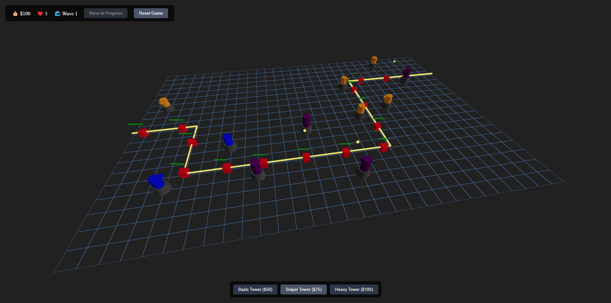

# R3F Tower Defence

A 3D tower defense game built with React Three Fiber, Three.js, and Zustand!



## Table of Contents

- [Installation](#installation)
- [Usage](#usage)
- [Technologies](#technologies)
- [Contributing](#contributing)
- [License](#license)

## Installation

1. Clone the repository:
   ```sh
   git clone https://github.com/adamistheanswer/r3f-tower-defence.git
   ```
2. Navigate to the project directory:
   ```sh
   cd r3f-tower-defence
   ```
3. Install the dependencies:
   ```sh
   npm install
   ```

## Usage

1. Start the development server:
   ```sh
   npm run dev
   ```
2. Open your browser and navigate to `http://localhost:5173`.

## Technologies

- **React Three Fiber**: A React renderer for Three.js, enabling the creation of 3D graphics using React components.
- **Three.js**: A JavaScript library that makes creating 3D graphics in the browser easier.
- **Zustand**: A small, fast, and scalable state-management solution for React.
- **Styled Components**: A library for styling React components using tagged template literals.

## Contributing

Contributions are welcome! Please open an issue or submit a pull request for any changes.

## License

This project is licensed under the MIT License.
